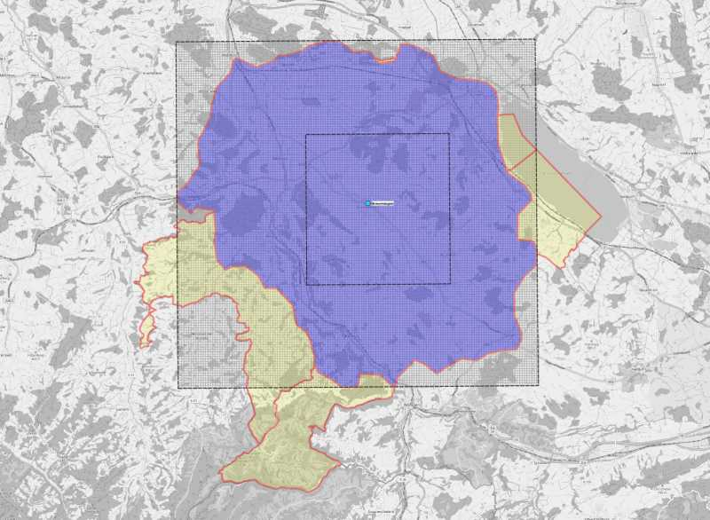

This is a _Gemeindescan_*. It contains project data for a municipality that is being analysed to assist in urban design and planning tasks. For more information, visit [CIVIDI](https://cividi.ch). Such data may include:

- Point data (CSV, GeoJSON) with project perimeters or statistics
- Vector data (GeoJSON, GeoPackage, Shapefile), such as surveys or proposals
- Pixel data (PNG, JPEG, TIFF, GeoTIFF), for example from satellite imagery
- ... Relevant data in other formats

Her is a preview in the form of an image file:

The main project metadata is specified with [Frictionless Data schema](https://frictionlessdata.io/specs) in a `datapackage.json` file in this folder, and also accessible (searchable, transformable..) through an API. The schema will be developed in accordance to the [Spatial Data Package](https://research.okfn.org/spatial-data-package-investigation/#point-datasets) standard.

All the projects here are processed in a manual or automated way with [DataFlows](https://github.com/datahq/dataflows). While open datasets can be stored directly in a subfolder (e.g. `src`), ideally every source dataset that is used in the processing is itself a Data Package. References to external storage locations or APIs for larger datasets can be made in the Data Package. Using Data Packages as sources allows us to conserve metadata in processing, and use Frictionless Data [software](https://frictionlessdata.io/software/) throughout the process.

This `project.md` file contains a description of the project as well as metadata in [YAML](https://yaml.org) format that is picked up by content management and publication. It should not specify any identifiers or schemas - only some contents which help to classify the project within the portal, provide some guidance to users on the Web site without affecting the way the data is used.

Additionally, a `README.md` file contains a brief standard description for developers of how to use this project repository, badges and links related to development and quality assurance, some background on how the data was obtained, any special legal restrictions or recommendations for people who continue to develop this repository.

While licenses for individual datasets must be specified in the Data Package, a `LICENSE` file specifies the author and terms of use for this Data Package repository itself, including any data that is generated by it.

If you have any questions, please contact us at [team@cividi.ch](mailto:team@cividi.ch)

---

* _Gemeinde_ is the German word for a commune, or municipality.
